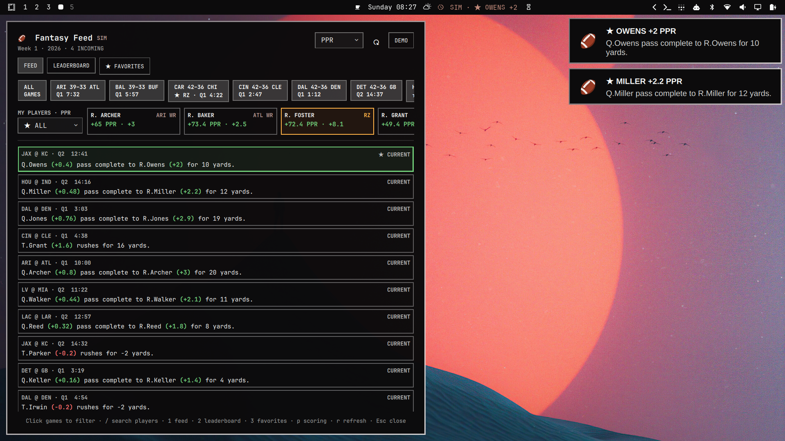
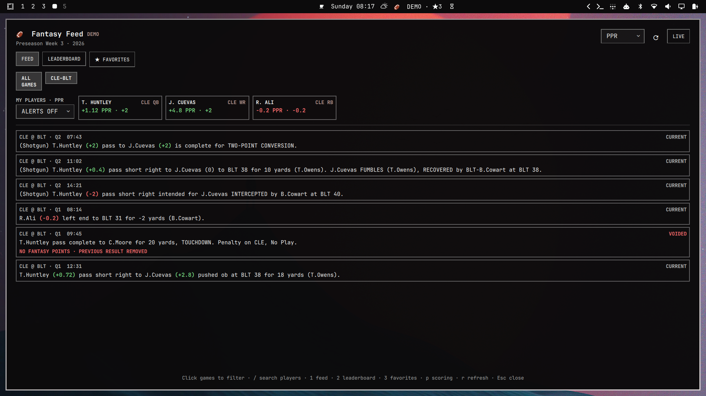
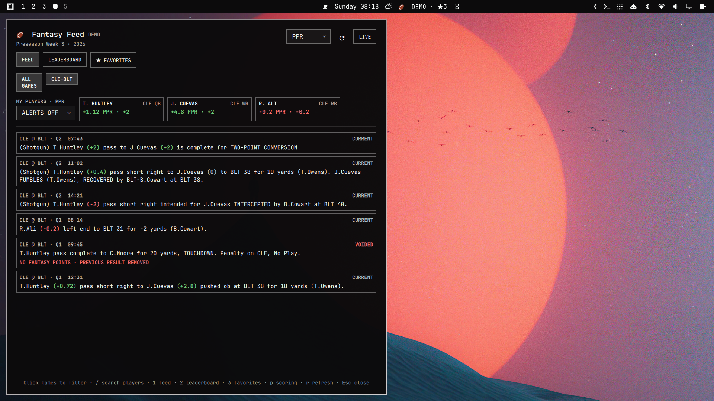

# Fantasy Feed (league-synced fork)

This fork of [studioxvii/omarchy-fantasy-feed](https://github.com/studioxvii/omarchy-fantasy-feed)
adds a **league sync**: an external script writes your ESPN fantasy matchup
into the plugin's favorites file, and the plugin turns that into a live
head-to-head -- your starters versus your opponent's, scored by your league's
actual rules, with ESPN's own totals in the bar. The plugin itself still needs
no account and never sees your credentials; the sync lives in
[espn-mcp](https://github.com/HamCops/espn-mcp) (`scripts/feed_sync.py`).

Install from this fork:

```sh
omarchy plugin add "https://github.com/HamCops/omarchy-fantasy-feed.git" --enable --yes
```

## League sync

`feed_sync.py` writes two files, both watched by the plugin, so a sync applies
without restarting the shell:

- `~/.config/omarchy/fantasy-feed.json` -- the existing favorites file. Each
  favorite gains `side: "me" | "opp"` and `slot` (QB, RB, FLEX, ...), and a
  `league` block carries the league name, week, both team names and the
  **scoring rules** in the plugin's stat vocabulary. Favorites you star by
  hand still work; they simply have no side.
- `~/.cache/fantasy-feed/league.json` -- ESPN's live matchup totals, projected
  totals and win probability, refreshed every minute while games are on.

With a league synced:

- **Bar**: `LIVE · ME 41.2 – 37.9 TM2`. ESPN's totals when the sync is fresh
  (they include K and D/ST, which the play parser cannot score); otherwise the
  sum of each side's weekly totals.
- **Rail**: `MATCHUP · LG`, your starters first, then the opponent's with a red
  border. An opponent's positive play pulses red -- their gain is your loss.
- **Standalone window, tab 4 (`⚔ MATCHUP`)**: both lineups side by side, slot
  by slot, weekly points and last play, with ESPN's line underneath.
- **Alerts**: opponent plays alert too, headlined `⚔ OPP`.
- **Scoring menu**: a `LEAGUE` option (`LG`) beside PPR/STD, selected
  automatically on the first sync. It applies the synced rules: ESPN's bucket
  form (1 point per *complete* 25 passing / 10 rushing / 10 receiving yards,
  floor) is honoured exactly in weekly totals; a single play's delta is scored
  linearly, since the bucket only resolves against the game total. Passing
  touchdowns worth 5, no PPR, whatever the league says.

Without a sync nothing changes: PPR/STD, favorites and alerts behave as
upstream.

## Highlight clips

Plays get a `▶ CLIP 2m` badge when a matching `[Highlight]` post appears on
r/nfl -- usually one to three minutes after the play, well ahead of ESPN's
own clips. Click the play (or press `Enter`/`v` on the selected play in the
compact panel) to open it in `mpv`; `yt-dlp` resolves streamable, x.com,
YouTube and v.redd.it links. With alerts on, a clip for a play that would
have alerted sends one follow-up notification whose click opens the video.

Matching is by participant name and time window (a clip must follow the
play), with touchdown plays preferring titles that say so. It is a best
guess, not a proof; a miss costs a wrong video, never wrong points.

Reddit's JSON API refuses non-browser clients, so `scripts/highlights.py`
reads the subreddit's public Atom feed: at most one read every 45 seconds,
only while games are live or recent plays are still unmatched, with a
five-minute backoff on any refusal. Posts are cached for eight hours in
`~/.cache/fantasy-feed/highlights.json`. A feed failure never fails a refresh.

[](https://github.com/studioxvii/omarchy-fantasy-feed/actions/workflows/ci.yml)
[](https://omarchy.org/)
[](LICENSE)



Fantasy Feed is an Omarchy plugin for following NFL plays through a
fantasy-football lens. A stable bar capsule shows feed health without resizing
on every snap. The compact panel expands each play into raw text, stat deltas,
and the points from a selectable PPR or standard profile; a shared My Players
rail tracks favorite totals, latest deltas, red-zone opportunities, and quiet
alerts. A standalone window adds weekly leaderboards and a favorites-only feed.

It uses the active Omarchy theme and deliberately avoids sportsbook branding,
accounts, contests, and roster management.

Install it directly from GitHub:

```sh
omarchy plugin add "https://github.com/studioxvii/omarchy-fantasy-feed.git" --enable --yes
```

## What it looks like

The horizontal bar presents a stable status such as:

```text
LIVE · ★3

# During a favorite-player arrival
LIVE · ★ CUEVAS +2.8
```

Opening the compact panel shows the game clock and matchup, ESPN's play text, the
current/corrected/voided lifecycle, with each affected player's selected points
inserted directly after their name in the play sentence. A PPR/STD menu in the
header changes every inline score and the weekly leaderboard sort together.
Play text wraps in full instead of being truncated; unusually long plays grow
only as much as needed. A bundled demo covers a reception, negative rush, interception,
catch-and-fumble, passing two-point conversion, and a reviewed touchdown that
becomes voided. Positive points are green, negative points are red, and zero is
neutral.

Pop the panel into a normal movable/tileable window for three views: the full
feed, a weekly QB/RB/WR/TE leaderboard sortable by PPR or standard points, and
a custom feed containing only plays by locally favorited players.

When players are favorited, a horizontally scrollable **My Players** rail shows
each player's weekly total and latest play delta in the selected scoring mode.
Positive and negative arrivals pulse green or red. Clicking a player jumps to
their latest scored play. The scoring selection is shared by every surface and
persists across shell restarts.

The rail's alert policy watches only newly arriving plays involving **My
Players**. The `3+` and `6+` presets compare one favorite participant's
points on that play in the currently selected PPR/STD mode—not the player's
weekly total. Hidden games do not alert, and Omarchy's do-not-disturb setting is
honored.

A horizontally scrollable game strip appears across both feed surfaces. Click
any matchup to toggle it independently; click **ALL** to hide or restore the
entire slate. Compact two-line chips show `ARI 21–18 ATL` above the live quarter
and remaining clock. Scheduled chips omit the repeated meridiem/time-zone suffix
and format the provider's UTC kickoff in the user's system timezone, with one
`ALL TIMES LOCAL` note for the slate; final games show the provider's final
detail. When a favorite's team has possession in the red zone, its chip turns
amber and shows `★ RZ` plus down-and-distance in the tooltip. The same selection
filters the compact feed, standalone feed, favorites feed, and weekly
leaderboard.

Newly discovered plays enter a shared live tape one at a time instead of
appearing as an unreadable poll-sized batch. Normal arrivals land every 600 ms;
the tape accelerates only when it is falling behind. A play involving a
favorited player receives a green `★` spotlight and remains at the live edge for
2.6 seconds. Scrolling away pauses auto-follow and exposes a `NEW ↑` control,
so incoming plays cannot pull the reader away from the play they are reading.

### Full- and half-screen layouts

The standalone window tiles cleanly as the main view or as a compact sidecar.
Both captures use the bundled deterministic demo, so positive, negative, zero,
and voided scoring states remain reproducible.





## Requirements

- Omarchy with the current shell plugin commands.
- Python 3. The runtime uses only the Python standard library.
- Network access for live data. Demo mode is deterministic and offline.

## Install

From a local clone, commit the files you want Omarchy to clone, then run this
from the repository root:

```sh
omarchy plugin add "file://$PWD" --enable --yes
```

From the published repository:

```sh
omarchy plugin add "https://github.com/studioxvii/omarchy-fantasy-feed.git" --enable --yes
```

The manifest installs one non-duplicated widget in the center section by
default.

To disable or remove an installed copy:

```sh
omarchy plugin disable io.github.studioxvii.fantasy-feed
omarchy plugin remove io.github.studioxvii.fantasy-feed --yes
```

## Use

- Left-click the bar item to open or close the feed.
- The feed refreshes automatically: every 15 seconds during live games, every
  30 seconds in the final 10 minutes before kickoff, every 2 minutes during the
  preceding hour, and every 15 minutes when kickoff is farther away. Once the
  slate is final it sleeps until a 6:00 AM local daily schedule check.
- Middle-click or **Refresh** requests an optional immediate refresh.
- Use **Demo/Live** to switch data modes and **↗** (or `o`) to pop out.
- Click any matchup in the game strip to add or remove that game. Any number of
  games can be selected at once; **ALL** toggles the complete slate.
- Use the arrow keys or `j`/`k` to move through plays, `r` to refresh, `d` to
  switch demo/live, `p` to toggle the selected PPR/STD profile, and `Esc` to
  close the compact panel. The header menu provides the same scoring control.
- In the standalone window, use `1`/`2`/`3` for feed/leaderboard/favorites and
  `p` to toggle PPR/standard display and sorting. Select `ALL`, `QB`, `RB`, `WR`, or `TE`,
  type in the player/team search (`/` focuses it), and use `☆`/`★` to update
  favorites from the leaderboard.
- Use the alert menu beside **My Players** to choose `OFF`, every favorite play,
  favorite touchdowns only, or a 3+/6+ point threshold. Alerts are low urgency,
  respect Omarchy Do Not Disturb, skip hidden games, and open the exact play
  when clicked.

The same service controls are available through Omarchy shell IPC:

```sh
omarchy-shell io.github.studioxvii.fantasy-feed status
omarchy-shell io.github.studioxvii.fantasy-feed refresh
omarchy-shell io.github.studioxvii.fantasy-feed demo
omarchy-shell io.github.studioxvii.fantasy-feed live
omarchy-shell shell toggle io.github.studioxvii.fantasy-feed
```

The data helper is also useful on its own:

```sh
# One live normalized snapshot
python3 scripts/feed.py --once

# The complete offline demo, or a specific zero-based replay frame
python3 scripts/feed.py --fixture fixtures/replays/demo.json
python3 scripts/feed.py --fixture fixtures/replays/demo.json --at 2
```

Normal JSON goes to stdout and diagnostics go to stderr, so the output can be
piped safely to tools such as `jq`.

## Scoring

The plugin ships two fixed scoring profiles. PPR differs from standard only by
the reception bonus.

| Stat | PPR | Standard |
| --- | ---: | ---: |
| Passing yard | 0.04 | 0.04 |
| Passing touchdown | 4 | 4 |
| Interception thrown | -2 | -2 |
| Rushing yard | 0.1 | 0.1 |
| Rushing touchdown | 6 | 6 |
| Reception | 1 | 0 |
| Receiving yard | 0.1 | 0.1 |
| Receiving touchdown | 6 | 6 |
| Passing two-point conversion | 2 | 2 |
| Rushing two-point conversion | 2 | 2 |
| Receiving two-point conversion | 2 | 2 |
| Fumble lost | -2 | -2 |

Negative yardage produces negative points. Version 1.0 intentionally excludes
kickers, team defense, points-allowed bands, half PPR, custom scoring, fantasy
league roster sync, projections, non-favorite alerts, contests, betting data,
and other sports.

Weekly leaderboard totals come from complete structured game box scores rather
than the bounded play feed. ESPN roster metadata is used only to assign the
QB/RB/WR/TE grouping. Favorites, the shared PPR/STD selection, and alert policy
are stored locally in
`$XDG_CONFIG_HOME/omarchy/fantasy-feed.json` (normally
`~/.config/omarchy/fantasy-feed.json`); no fantasy account is required.

## Reliability and corrections

Fantasy Feed does not award plausible-looking points when attribution is
uncertain. A supported play must match a constrained narrative family, resolve
every player uniquely against structured boxscore athlete IDs, and agree with
the provider's flags, yardage, and per-play official statistics. Unsupported or
contradictory plays stay in bounded diagnostics rather than the scored feed.

Events are keyed by provider, game ID, and play ID. A changed provider revision
replaces that event and marks it corrected. If a revision becomes a no-play or
unsupported result, the former score becomes a voided event instead of leaving
duplicate points behind. The visible event and diagnostic lists are each capped
at 200 records.

The provider adapter merges both completed drives and the drive currently in
progress. ESPN can briefly expose the same play in both locations while moving
a finished possession, so play IDs are deduplicated with the current revision
winning. This prevents live fantasy plays from arriving in a batch only after
the drive ends.

The singleton service permits only one helper process for every monitor and
for the standalone window. Its one-shot scheduler inspects every game rather
than trusting only the aggregate slate state, so a final Thursday game cannot
hide scheduled Sunday games. Live polling runs every 15 seconds; scheduled
polling tightens from 15 minutes to 2 minutes to 30 seconds as kickoff nears.
An entirely final/idle slate sleeps until the next 6:00 AM local check. Failed
refreshes back off through 1, 2, 5, and 15 minutes. The helper retains its
18-second watchdog and never overlaps another refresh.

Provider ingestion and feed presentation are deliberately separate. Scoreboard,
leaderboard, and cache state apply immediately, while new event revisions enter
one shared arrival queue used by every monitor and the standalone window. The
queue uses 600/300/160 ms normal, catch-up, and urgent pacing; a favorite arrival
holds for 2.6 seconds. Initial loads and data-mode/week changes hydrate at once
instead of replaying an old cache card by card.

Red-zone watch uses ESPN's optional scoreboard situation object rather than an
additional endpoint. Missing or malformed possession data fails closed to no
red-zone accent. Desktop alerts are emitted only for newly presented favorite
events that match the saved policy; they use Omarchy's low-urgency notification
path and carry an argv-safe click action back to the corresponding play.

Fresh live data is written atomically to a mode-`0600` last-good cache at:

```text
$XDG_CACHE_HOME/fantasy-feed/snapshot.json
```

`XDG_CACHE_HOME` must be absolute; otherwise the path is
`~/.cache/fantasy-feed/snapshot.json`. A failed refresh never overwrites that
cache. With a valid cache, the helper emits a stale/offline snapshot and exits
`10`; without one, it emits no snapshot and exits `20`. The UI retains its last
valid in-memory snapshot and marks it stale when a later helper run fails.

## Data source and design note

Live mode reads undocumented public ESPN NFL JSON endpoints. They require no
credentials, but they are unsupported and may change or disappear. Recorded
fixtures and demo mode remain useful without ESPN, and the adapter is isolated
in `scripts/espn.py` so provider changes do not leak into QML.

Matt Van Horn's [CLI Printing Press](https://github.com/mvanhorn/cli-printing-press)
and its generated [ESPN CLI](https://github.com/mvanhorn/printing-press-library/tree/main/library/media-and-entertainment/espn)
were evaluated as an operational reference, particularly for its 30-second
watch cadence and cache/retry discipline. It is not a runtime dependency:
Fantasy Feed needs ESPN's per-play participant-stat references and a revision
reducer tailored to correcting fantasy events.

Fantasy Feed is not affiliated with, endorsed by, or sponsored by ESPN or
DraftKings. ESPN and DraftKings are trademarks of their respective owners.

## Develop and verify

Run the production smoke checks and plugin validator from the repository root:

```sh
python3 -m compileall -q scripts
python3 scripts/feed.py --fixture fixtures/replays/demo.json
omarchy plugin validate "$PWD"
git diff --check
```

The submitted default branch contains only runtime files, the single offline
demo fixture, documentation, and marketplace media. The complete development
harness and historical load-testing tools remain available on the
[development branch](https://github.com/studioxvii/omarchy-fantasy-feed/tree/development).
Architecture details live in [docs/architecture.md](docs/architecture.md).

## License

[MIT](LICENSE) © 2026 Tom Hammond.

## Built on revived hardware

Fantasy Feed was designed, tested, and captured on an eight-year-old
[Dell Latitude 7490](https://www.dell.com/support/product-details/en-ap/product/latitude-14-7490-laptop/resources/manuals)
brought back to life with Omarchy. Dell's Latitude 7490 documentation dates to
January 2018; this release was completed in August 2026.

| Component | This machine |
| --- | --- |
| CPU | [Intel Core i5-8250U](https://www.intel.com/content/www/us/en/products/sku/124967/intel-core-i58250u-processor-6m-cache-up-to-3-40-ghz/specifications.html), 4 cores / 8 threads, 1.6–3.4 GHz |
| Memory | 8 GB |
| Graphics | Intel UHD Graphics 620 |
| Storage | 256 GB SK hynix SC401 SATA SSD |
| Display | 1920×1080 LG panel at 60 Hz |
| System | Omarchy 4.0.1 on Linux 7.1.9 |
